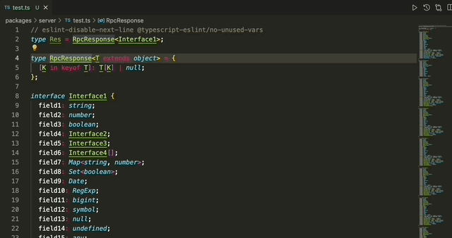
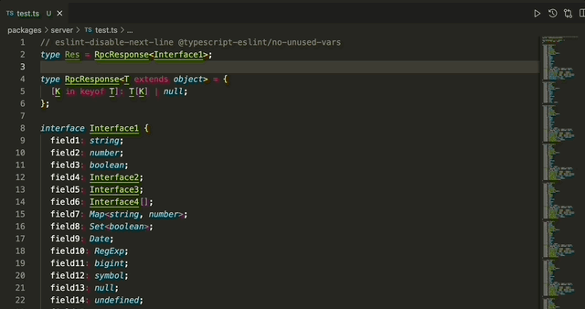
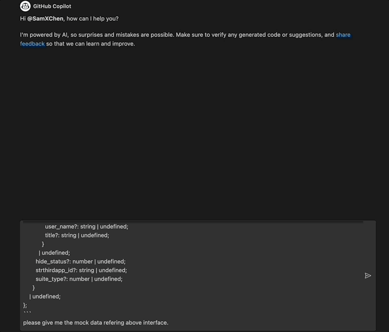

# TS Viewer Extension

This project is a [Visual Studio Code](https://code.visualstudio.com/) extension that allows you to view TypeScript Interfaces and Types entire information easily.

There are two packages in this project:

1. `ts-viewer-extension`: The extension itself.
2. `ts-viewer-language-plugin`: A TS plugin that provides the information about the TypeScript Interfaces and Types.

## Features

- View the entire information of a TypeScript Interface or Type.

- Expose a TypeScript Helper Type that helps developer to expand the information of an existed TypeScript Interface or Type if needed.

## Further Usage

- After getting entire information of a TypeScript Interface or Type, you can easily mock the data for it by using AI-assisted mock data generator.

## Smoke Fixtures

- Minimal smoke fixtures now live under `tests/fixtures` for TypeScript, JavaScript, and TSX workspaces.
- Smoke runners now live under `tests/scripts` and execute through `tsx`, so the fixture pipeline stays in TypeScript end to end.
- Run `pnpm validate:fixtures` to verify the fixture set still matches the extension activation and connection-layer expectations.
- The fixture pipeline now includes compiler-driven usage smoke tests, so `pnpm validate:fixtures` checks real type resolution for the TS, JS, and TSX scenarios.
- The fixture pipeline also checks hover-preview shaping and full-view request payloads for the current interaction model.
- Service stability smoke now verifies restart and recovery behavior for TypeScript requests against the plugin HTTP layer.
